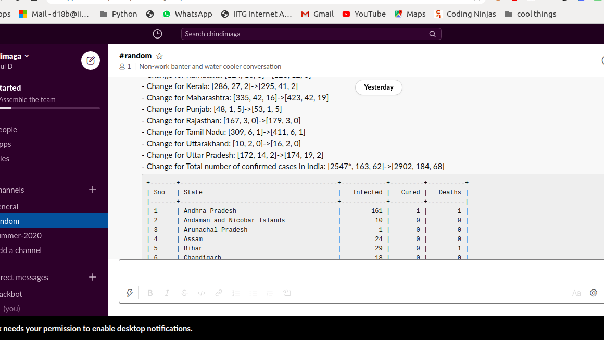
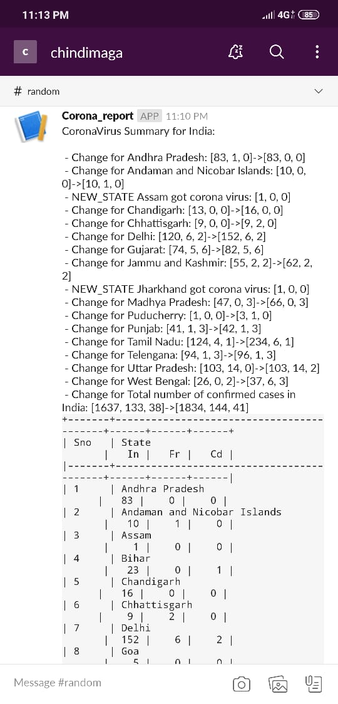

# Update_messenger

This script sends you updates regularly about the the statistics of the people infected by **covid-19** in all states in India. 

# Requirements
This code is written entirely in python 3. The following libraries are necessary. 

 - BeautifulSoup4
 - tabulate
 - requests
 You can install them by following commands (for linux users):
>pip install beautifulsoup4
>pip install tabulate
>pip install requests
## Preview
 
 

When ever there is a change in the data, the script automatically sends a message similar to this.
 
## Cron daemon

This will help you run the script at regular time intervals. Ofcourse you have to keep your computer on.
><dl><dt>Open your terminal and run this command</dt><dd>crontab -e</dd><dt>Append this text to run the scirpt every 20 mins</dt><dd>*/20 * * * * cd < PATH TO WORKING DIRECTORY >; python 3 main.py</dd></dl>
[For more info on cron-deamon click this link
](https://www.geeksforgeeks.org/crontab-in-linux-with-examples/)
## Issues faced

 - What if a new state is added:
     I had deployed this script. But when a new state was added my script stopped working. 
     Resolved this by making small changes in code and by writing the whole code inside a try block and in the except block i made sure that i would get an error message if the script doesn't work.
 - When the data already stored is lost by accident:
	If by any chance the data is lost (i deleted the json file) it shot an error. I tried making it more robust by automatically creating a new database and start storing the data from that time stamp and send a message to the user that the database was lost and new database has been initialised.

      

## Slack client

It is an amazing app. You get a webhook when you create an app. Using the web hook you can easily send the message to your thread. If you are working in machine learning , you can use the code to get updates about how much the training has been done. You can get notifications on phone if you install the app.

# Dataset

Finally i have a data set, which is almost ready for a time series analysis

## 

If you feel that i can further improve my code please feel free to contact me.
